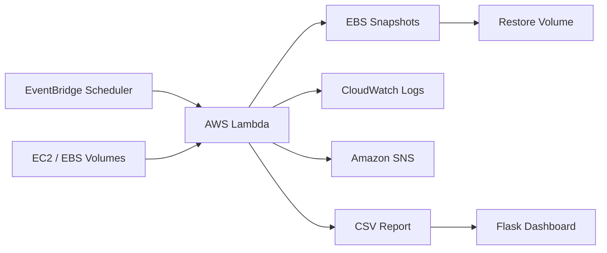

# Automated AWS EBS Snapshot Manager

## Project Overview

A production-oriented Python application that backs up multiple Amazon EBS volumes,
enforces snapshot retention, sends Amazon SNS notifications, records operational
activity, and exposes backup health through a Flask dashboard. AWS Lambda runs the
workflow and Amazon EventBridge Scheduler triggers it automatically.

No AWS credentials, secret keys, or access keys are included. Boto3 uses the normal
AWS credential provider chain and Lambda execution roles.

## Architecture



See [Architecture](docs/Architecture.md) for the detailed data flow and safety
boundaries.

## Features

- Multi-volume snapshot creation from `config.json`
- Retention-based deletion restricted to project-managed snapshots
- Dry-run simulation with no AWS resource changes
- CloudWatch-compatible creation, deletion, error, and duration logging
- SNS notification after every accepted snapshot creation
- CSV snapshot report and Flask status dashboard
- New-volume restoration from a chosen snapshot
- PEP 8 code with type hints, docstrings, and isolated exception handling
- Mock-based unit tests and GitHub Actions quality checks

## AWS Services Used

| Service | Purpose |
|---|---|
| Amazon EC2 / EBS | Source volumes, snapshots, and restored volumes |
| AWS Lambda | Serverless execution of the manager |
| EventBridge Scheduler | Recurring Lambda invocation |
| CloudWatch Logs | Centralized operational and error logs |
| Amazon SNS | Backup success notifications |
| AWS IAM | Least-privilege runtime and deployment access |

## Folder Structure

```text
.
|-- .github/workflows/python.yml
|-- dashboard/
|   |-- templates/index.html
|   `-- app.py
|-- docs/
|-- reports/snapshot_report.csv
|-- sample_data/
|-- tests/
|-- cleanup_snapshots.py
|-- config.json
|-- config_loader.py
|-- reporting.py
|-- restore_volume.py
|-- snapshot.py
|-- snapshot_manager.py
|-- sns_notify.py
`-- requirements.txt
```

## Installation

```bash
python -m venv .venv
pip install -r requirements.txt
```

Configure `config.json`, initially with `"dry_run": true`, then run:

```bash
python snapshot_manager.py
pytest -q
python dashboard/app.py
```

Detailed instructions are in [Installation](docs/Installation.md).

## Configuration

```json
{
  "region": "ap-south-1",
  "retention_days": 7,
  "volumes": ["vol-0da27d539b52658d8"],
  "project_name": "Automated-EBS-Snapshot-Manager",
  "sns_topic_arn": "",
  "dry_run": false,
  "availability_zone": "ap-south-1a",
  "volume_type": "gp3",
  "report_path": "reports/snapshot_report.csv"
}
```

`CONFIG_PATH` can point to a different configuration. An empty SNS ARN disables
notifications. The dashboard report can be overridden with `SNAPSHOT_REPORT_PATH`.

## Lambda Deployment

Build a zip containing dependencies, the top-level Python modules, and `config.json`.
Use Python 3.12 and handler `snapshot_manager.lambda_handler`. Assign the IAM
execution role, set a suitable timeout, invoke a test event, and inspect the
function's CloudWatch log group. Lambda redirects a relative CSV report path to
`/tmp`; use S3 or a database if durable history is required.

See [AWS Setup](docs/AWS_Setup.md) for packaging and permissions.

## EventBridge Scheduler

Create a recurring schedule with the Lambda function as target and an invocation
role that allows `lambda:InvokeFunction`. Configure retries and a dead-letter queue,
and choose the schedule timezone explicitly to prevent operational ambiguity.

## IAM Setup

The Lambda role needs basic CloudWatch Logs permissions plus scoped EC2 snapshot and
SNS publish actions. The operator performing restores additionally needs
`ec2:CreateVolume`. Restrict resources and SNS topics to the intended account and
environment. A policy template is provided in [AWS Setup](docs/AWS_Setup.md).

## Dashboard

The dashboard shows Total Snapshots, Latest Snapshot, Last Backup Time, Backup
Status, and recent activity. It also exposes `/api/metrics` and `/health`. It is a
local/internal demonstration surface with no authentication; do not expose it to an
untrusted network without adding access control and TLS.

## Disaster Recovery

1. Identify a completed, verified snapshot.
2. Confirm the target Availability Zone in `config.json`.
3. Run `python restore_volume.py <snapshot-id>`.
4. Wait until the volume is available, attach it to an EC2 instance, and mount it.
5. Validate filesystem/application consistency before redirecting production work.

Regularly test this process. A backup that has never been restored is an optimistic
theory, not a recovery plan.

## Future Enhancements

- Durable S3 or DynamoDB reporting and dashboard history
- Cross-Region and cross-account snapshot copies
- KMS customer-managed key support and key-policy checks
- Snapshot completion events and restore verification automation
- Prometheus/CloudWatch metrics, alarms, and incident routing
- Authentication and role-based access for the dashboard
- Infrastructure as Code with AWS SAM, CDK, or Terraform
- AWS Backup policy integration for enterprise governance

## Screenshots

Add screenshots here after deployment:

- Flask dashboard overview
- Lambda invocation result
- CloudWatch execution logs
- Tagged EBS snapshot in the EC2 console
- SNS notification delivery
- Passing GitHub Actions workflow

## Additional Documentation

- [Project Report](docs/Project_Report.md)
- [Architecture](docs/Architecture.md)
- [AWS Setup](docs/AWS_Setup.md)
- [Installation](docs/Installation.md)
- [Live Demo](docs/Live_Demo.md)
- [Viva Questions](docs/Viva_Questions.md)
