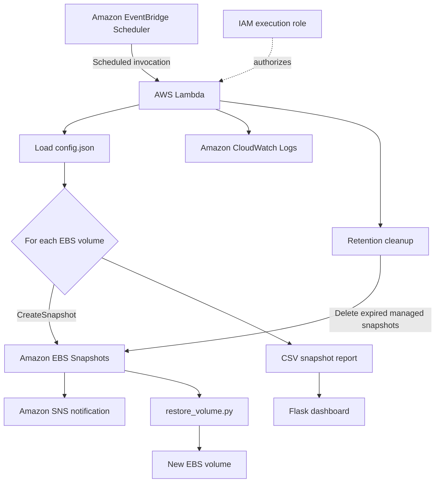

# Architecture

## System design

## Component responsibilities

| Component | Responsibility |
|---|---|
| `snapshot_manager.py` | Lambda entry point and workflow orchestration |
| `snapshot.py` | Creates or simulates a tagged snapshot |
| `cleanup_snapshots.py` | Deletes project-owned snapshots beyond retention |
| `sns_notify.py` | Publishes snapshot success messages |
| `reporting.py` | Appends snapshot metadata to CSV |
| `restore_volume.py` | Creates a new EBS volume from a selected snapshot |
| `dashboard/` | Presents report-derived backup metrics |
| CloudWatch Logs | Captures actions, failures, and execution duration |

## Safety boundaries

Cleanup requests snapshots owned by the current AWS account and requires both
`Project=<project_name>` and `ManagedBy=snapshot-manager` tags. A failure on one
volume does not stop backups for other configured volumes. Dry-run mode avoids all
snapshot create/delete and SNS publish calls.

## Report persistence

Locally, reports are written to `reports/snapshot_report.csv`. Lambda can only write
to `/tmp`, so the manager automatically redirects a relative report path there when
`AWS_LAMBDA_FUNCTION_NAME` is set. `/tmp` is ephemeral; production audit retention
should export the report to S3, DynamoDB, or a centralized observability platform.
